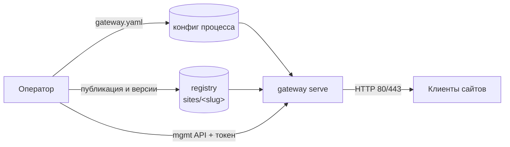
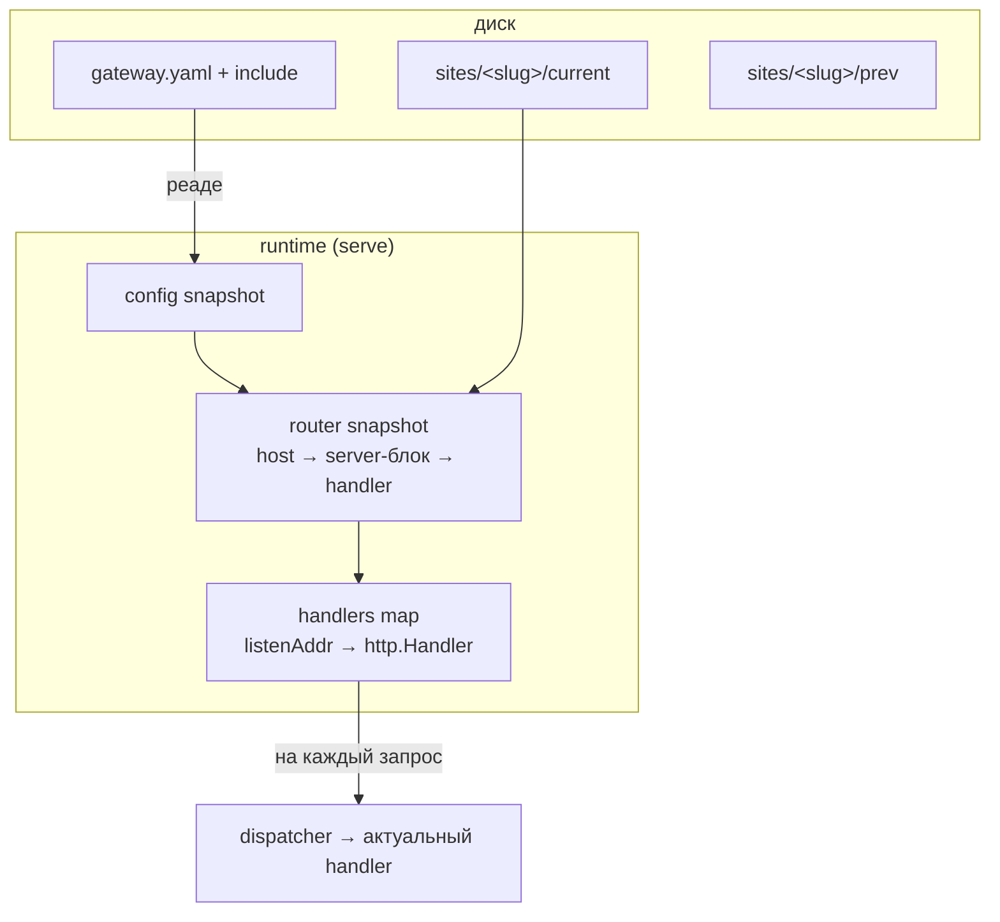
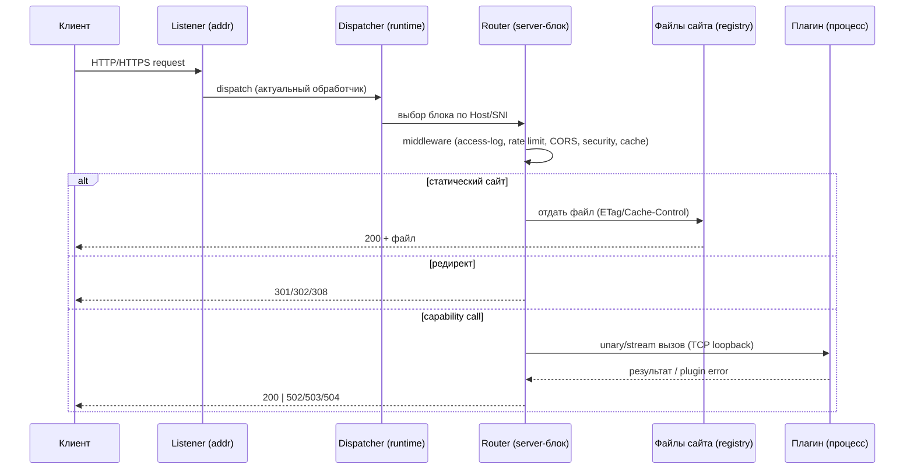
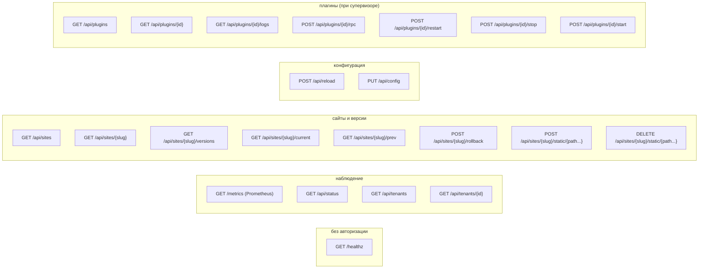

# Gateway: data plane и control plane

## Модель процессов

Liapoldus — это **один процесс**: gateway. Его роль — data plane (публичный
рантайм), управление и автономная CLI-доставка; собственной БД у него нет.

| Процесс | Роль | БД | Обязателен |
| --- | --- | --- | --- |
| `gateway` | data plane + управление: публичный рантайм, mgmt API, CLI | нет | да |

Gateway не является монолитом и не имеет доступа к БД. Он читает только два
источника с диска:

- персональный конфиг процесса — `gateway.yaml` (+ `include`);
- готовые артефакты из **registry-volume** — `sites/<slug>/<version>/...`,
  сформированные оператором по контракту.

Оператор пишет в registry и дергает mgmt-порт напрямую — отдельной системы
управления нет.

## Конфигурация процесса

- Путь к конфигу: аргумент `--config`, либо env `LIAPOLDUS_GATEWAY_CONFIG`;
  пустое значение — встроенный default.
- Формат — YAML; секции: `instance`, `registry`, `listen`, `management`,
  `plugins`, `tenants`, `serviceAccounts`, `include`, `server`, `http`, `security`,
  `metrics`, `tls`.
- `include` — дополнительные файлы (nginx-подобно); server-блоки объединяются.
- Сайты, опубликованные в `<registry>/sites/<slug>/config.yaml`,
  включаются **транспарентно** — без явных server-блоков.

### Конфиг сайта (unified schema)

Персональный конфиг каждого сайта лежит в `<registry>/sites/<slug>/config.yaml`
и описывает: `slug`, `id`, `hosts`, `languages`, `defaultLang`, `redirects`
(с status), `routes` (matcher → target, priority). Этот файл — единый источник
для CLI, mgmt API и runtime.

## Data plane

### Слушатели и маршрутизация

Gateway слушает один или несколько адресов (`server.listen`), каждый адрес
обслуживает свой набор server-блоков:

- выбор блока — по `serverName` (Host/SNI);
- fallback для слушателя — первый блок;
- `site` — каталог в registry; `root` — прямой каталог; `proxyPass` — восходящий
  upstream.

TLS: на слушателе индексируются сертификаты всех его блоков по хостам, выбор по
SNI (`GetCertificate`), fallback — первый серт. При TLS HTTP/2 включается
автоматически (ALPN h2). На «голом» HTTP HTTP/2 доступен как h2c (по конфигу
сервера, по умолчанию включён).

### Immutable snapshot

`serve` собирает **неизменяемый снапшот** на диске (актуальная версия каждого
сайта + personal-конфиг) и обслуживает запросы из него. Файлы сайтов не пишутся
в рантайме; обновления происходят заменой снапшота.

Смена конфига без изменения «подписи слушателей» (listen-адреса, таймауты,
mgmt-порт/токен, TLS-серты, http2-флаги) применяется горячо через `/api/reload`.
Если подпись меняется, gateway честно отвечает `409 restart required` — без
ложного «reloaded».

### Путь запроса

### Middleware

Каждый middleware читает конфиг серверного блока и применяется к ответу
(`internal/presentation/serve/web.go`):

- **compression** — gzip или brotli по `Accept-Encoding` (по конфигу `off`);
  при сжатии убираются `Content-Length` и `ETag`, добавляется `Vary`.
- **access log** — структурированный JSON или plain line; remote IP, метод, URI,
  host, status, длительность, байты, UA, опционально `X-Request-Id`.
- **rate limit** — token bucket по IP (`ipLimiter`), ответ `429` + `Retry-After`;
  запись автоматически удаляется после окна.
- **CORS** — по конфигу сервера: allow-origin по списку (включая `*`), методы,
  headers, `Max-Age`; `OPTIONS` → `204`.
- **security headers** — `Content-Security-Policy`, `X-Frame-Options`,
  `X-Content-Type-Options` (`nosniff`), `Referrer-Policy`, `Strict-Transport-Security`
  (HSTS только при TLS).
- **cache** — слабый `ETag` по размеру+времени файла и `Cache-Control` по типу
  файла, если не заданы заранее.

## Control plane

### Management-порт

Резервированный порт управления (`management.enabled/port/token`), отдельный
канал наблюдения и управления. Безопасность:

- токен задан → обязателен Bearer-токен (`Authorization`/`X-Management-Token`)
  или API key (`X-API-Key`), сверка — constant-time;
- токен пуст → запросы только с loopback;
- CLI может выключить управление флагом `--no-management`;
- в docker-композиции mgmt-порт наружу пробрасывается только на loopback хоста.

Абстракция авторизации: service accounts (`lpgw_<id>_<key>`, bcrypt-хеш в
конфиге) с ролями `platform-admin` / `tenant-admin`; `tenantAuth` допускает
`tenant-admin` только к своему `/api/tenants/{id}`.

### Эндпоинты mgmt

Все операции mgmt дублируют автономные CLI-команды и работают с тем же диском
(registry), что и runtime. `/api/plugins/{id}/rpc` — проксирование произвольного
RPC плагина (raw JSON), доступ только по mgmt-авторизации.

### CLI: автономная доставка

CLI — это **не третий бинарник**: подкоманды единого бинарника gateway,
офлайн-режим доставки. Они читают персональные конфиги и артефакты с диска и
не требуют работающего runtime:

| Подкоманда | Назначение |
| --- | --- |
| `serve` | единственный долгоживущий процесс (публичный рантайм + mgmt) |
| `versions` | список версий сайта на диске |
| `current` / `prev` | показать текущую/предыдущую версию |
| `rollback` | prev становится current (атомарно через `.rollback-tmp`) |
| `config` | показать персональный конфиг сайта (unified schema) |
| `routes` | показать маршруты и редиректы сайта |
| `status` | диагностика: listen, mgmt, сайты на диске |
| `health` | автономная проверка здоровья registry |
| `accounts` | выпуск/ротация/отзыв service account API keys |
| `help` | справка |

## Метрики

`infrastructure/metrics` — порт `domain.MetricsPort`. Включается в `cmd`, если
настроен хотя бы один экспорт:

- **Prometheus** — `GET /metrics` на mgmt-порте (за авторизацией);
- **OTLP push** — периодическая отправка в эндпоинт (интервал по конфигу,
  по умолчанию 15s).

Prefix метрик — `gateway_`.

## Ошибки и graceful shutdown

- `serve` ждёт `SIGINT`/`SIGTERM`, затем останавливает супервизор плагинов
  (`manager.Close()`) и гасит все `http.Server` через `Shutdown(ctx)` с
  таймаутом 10s.
- Ошибки plugin-вызовов (см. protocol.md) преобразуются в согласованные 5xx
  ответы gateway: startup/failure → 503, timeout/disconnect → 504, plugin
  internal error → 502.