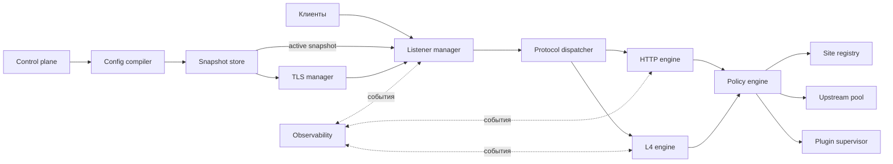

# Компоненты runtime

Gateway — единый процесс data plane и local control plane. Он не хранит
прикладные данные сайтов, пользователей или пиров: источником состояния служат
YAML, registry и защищённое certificate storage.



## Границы компонентов

| Компонент | Входы и выходы | Владеет | Ошибки |
| --- | --- | --- | --- |
| Config Compiler | YAML/include → validated graph | digest, source map, ссылки ресурсов | path-aware validation error |
| Snapshot Store | compiled graph → active snapshot | immutable snapshots, drain lifecycle | apply conflict, preparation failure |
| Listener Manager | snapshot → sockets | bind, accept, connection drain | bind/address conflict |
| Protocol Dispatcher | connection/datagram → engine | protocol selection и request/flow context | unsupported protocol, malformed ClientHello |
| HTTP Engine | request → response | routing, static, proxy upgrade | route miss, upstream failure |
| L4 Engine | stream/datagram → target | flow state, byte/idle limits | timeout, flow limit |
| TLS Manager | ClientHello/profile → secure transport | cert selection, ACME renewal, mTLS | cert unavailable, client auth failure |
| Upstream Resolver/Pool | target group → healthy endpoint | DNS cache, health, balancing | no healthy endpoint |
| Policy Engine | context + route → decision | auth, WAF, limits, headers | deny, challenge, policy provider unavailable |
| Site Registry | site name → release files | current/previous pointers | missing or invalid release |
| Plugin Supervisor | plugin target → capability session | process, health, limits, IPC | unavailable, protocol violation |
| Control Plane | CLI/API → use cases | authorization, revision/audit | forbidden, optimistic-lock conflict |
| Observability | lifecycle events → telemetry | request/connection IDs, redaction | exporter failure is non-fatal |

## Жизненный цикл конфигурации

```mermaid
sequenceDiagram
  participant O as Operator / API
  participant C as Config Compiler
  participant S as Snapshot Store
  participant R as Runtime
  O->>C: YAML tree + expected digest
  C->>C: include, secrets, validation, regex compile
  C->>S: compiled resource graph
  S->>R: prepare listeners, TLS, pools, plugins
  alt подготовка успешна
    R-->>S: ready
    S->>S: atomic active snapshot swap
    S->>R: drain old snapshot
    S-->>O: revision + digest + audit event
  else подготовка неуспешна
    R-->>S: typed error
    S-->>O: error; active snapshot unchanged
  end
```

## Пути трафика

HTTP: listener → TLS termination при необходимости → dispatcher → route →
policy chain → site/upstream/plugin → response + telemetry.

TCP: listener → optional ClientHello inspection or TLS termination → L4 rule →
policy chain → bidirectional upstream/plugin session.

UDP: listener → flow key → L4 rule → policy chain → upstream/plugin datagrams
до idle timeout. P2P использует второй или третий путь как защищённый relay.
