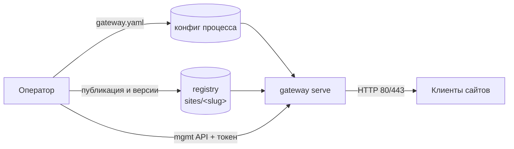
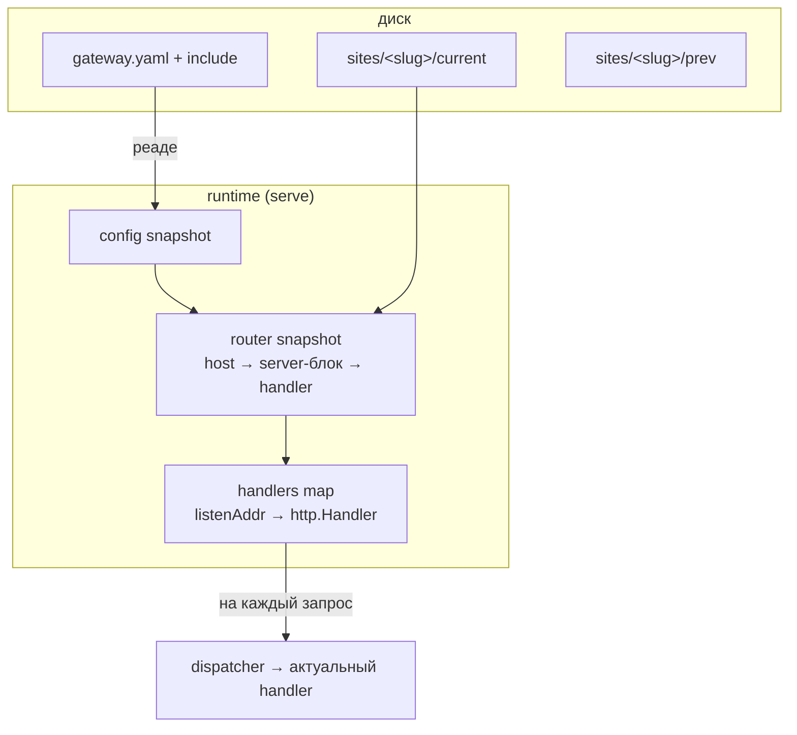
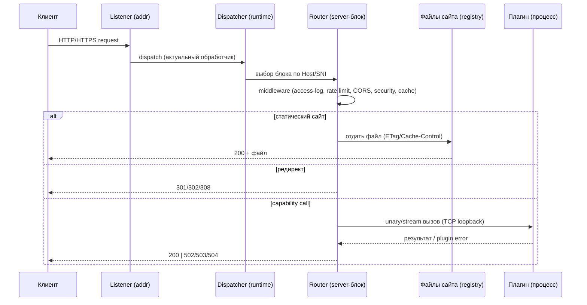

# Gateway: data plane и control plane

## Модель процессов

Liapoldus — это **один процесс**: gateway. Его роль — data plane (публичный
рантайм), управление и автономная CLI-доставка; собственной БД у него нет.

| Процесс | Роль | БД | Обязателен |
| --- | --- | --- | --- |
| `gateway` | data plane + управление: публичный рантайм, mgmt API, CLI | нет | да |

Источники состояния — только на диске:

| Источник | Содержимое |
| --- | --- |
| персональный конфиг процесса | `gateway.yaml` (+ `include`); схема — [корневая схема](/gateway/configuration/root-schema) |
| **registry-volume** | `sites/<slug>/<version>/...`; конфиг сайта — [unified schema](/gateway/configuration/site-config) |

Оператор пишет в registry и дергает mgmt-порт напрямую — отдельной системы
управления нет.

## Data plane

### Слушатели и маршрутизация

Gateway слушает один или несколько адресов (`server.listen`), каждый адрес
обслуживает свой набор server-блоков (см. [Server-блоки](/gateway/configuration/server-blocks)):

- выбор блока — по `serverName` (Host/SNI); fallback — первый блок слушателя;
- `site` — каталог в registry; `root` — прямой каталог; `proxyPass` — upstream;
- TLS: сертификаты блоков индексируются по хостам, выбор по SNI; при TLS HTTP/2
  включается автоматически (ALPN h2), на «голом» HTTP — h2c.

### Immutable snapshot

`serve` собирает **неизменяемый снапшот** на диске (актуальная версия каждого
сайта + personal-конфиг) и обслуживает запросы из него. Файлы сайтов не пишутся
в рантайме; обновления происходят заменой снапшота.

Смена конфига без изменения «подписи слушателей» (listen-адреса, таймауты,
mgmt-порт/токен, TLS-серты, http2-флаги) применяется горячо через `/api/reload`.
Если подпись меняется, gateway отвечает `409 restart required` — без ложного
«reloaded».

### Путь запроса

### Middleware

Каждый middleware читает конфиг серверного блока
(`internal/presentation/serve/web.go`):

| Middleware | Поведение |
| --- | --- |
| **compression** | gzip/brotli по `Accept-Encoding` (по конфигу `off`); при сжатии убираются `Content-Length` и `ETag`, добавляется `Vary` |
| **access log** | структурированный JSON или plain; remote IP, метод, URI, host, status, длительность, байты, UA, опционально `X-Request-Id` |
| **rate limit** | token bucket по IP (`ipLimiter`), ответ `429` + `Retry-After`; запись удаляется после окна |
| **CORS** | allow-origin по списку (включая `*`), методы, headers, `Max-Age`; `OPTIONS` → `204` |
| **security headers** | CSP, `X-Frame-Options`, `X-Content-Type-Options` (`nosniff`), `Referrer-Policy`, HSTS (только при TLS) |
| **cache** | слабый `ETag` по размеру+времени файла и `Cache-Control` по типу файла, если не заданы заранее |

## Control plane

### Management-порт

Резервированный порт управления (`management.enabled/port/token`) — отдельный
канал наблюдения и управления. Правила безопасности, service accounts и
эндпоинты — в [Безопасность](/gateway/configuration/security) и
[Management API](/gateway/configuration/management-api).

### CLI: автономная доставка

CLI — **не третий бинарник**: подкоманды единого бинарника gateway, офлайн-режим
доставки. Читают персональные конфиги и артефакты с диска и не требуют
работающего runtime (`serve` — единственный долгоживущий процесс). Справочник —
[CLI](/gateway/cli/).

## Метрики

`infrastructure/metrics` — порт `domain.MetricsPort`. Включается в `cmd`, если
настроен хотя бы один экспорт (`prefix` метрик — `gateway_`):

| Экспорт | Механизм |
| --- | --- |
| **Prometheus** | `GET /metrics` на mgmt-порте (за авторизацией) |
| **OTLP push** | периодическая отправка в эндпоинт (интервал по конфигу, по умолчанию 15s) |

## Ошибки и graceful shutdown

- `serve` ждёт `SIGINT`/`SIGTERM`, затем останавливает супервизор плагинов
  (`manager.Close()`) и гасит все `http.Server` через `Shutdown(ctx)` с
  таймаутом 10s.
- Ошибки plugin-вызовов (см. [protocol.md](protocol.md)) преобразуются в
  согласованные 5xx: startup failure → 503, timeout/disconnect → 504, plugin
  internal error → 502.