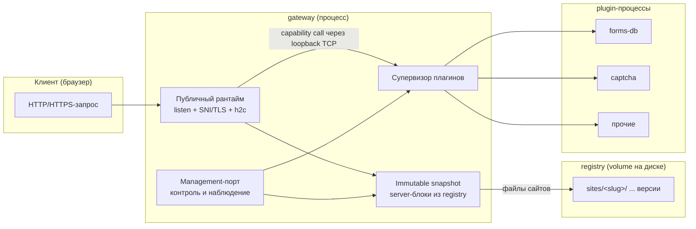

# Liapoldus: архитектура

Архитектура задаёт состав системы, её внешние контракты и границы
ответственности. Детальные страницы фиксируют поведение продукта и правила,
которым следует реализация.

Liapoldus состоит из:

1. **Gateway** — самостоятельный multi-tenant web server и reverse proxy.
   Он принимает HTTP(S), TCP и UDP, компилирует YAML в immutable runtime
   snapshots, управляет TLS, upstream и внешними plugin-процессами.
2. **Plugins** — отдельные кроссплатформенные процессы, которые gateway
   запускает и вызывает только из YAML-rule через plugin protocol. Плагин не
   создаёт публичный listener и не управляет маршрутизацией gateway.

Gateway — единственная обязательная часть; plugins подключаются по мере
надобности.

## Общая схема

## Компоненты

| Часть | Назначение | Зависимости |
| --- | --- | --- |
| **gateway** | публичный рантайм, раздача сайтов, плагины | без БД; читает файлы конфигов и registry |
| **plugins** | отдельные binary: формы, капча и т.д. | TCP loopback + protobuf протокол |

## Принципы

| Принцип | Что это даёт |
| --- | --- |
| **Gateway без БД** | конфиги и версии сайтов — файлы на диске (registry); runtime — производная величина от файлов |
| **Один процесс** | data plane и управление в едином process; нет отдельных сервисов |
| **Plugins — отдельные процессы** | gateway запускает инстансы; несколько инстансов одного binary с разными конфигами |
| **Явный plugin target** | route или L4-rule назначает capability; плагин не добавляет скрытые endpoint’ы |
| **DDD-слои** | единая структура всех Go-проектов и общая библиотека `pkg` через `go.work` |

## Документы

| Файл | Содержание |
| --- | --- |
| [target.md](target.md) | Системный контекст, архитектурные решения и инварианты. |
| [structure.md](structure.md) | Структура репозиториев, обязательные DDD-слои, правила зависимостей, общая библиотека `pkg`. |
| [gateway.md](gateway.md) | Data plane и control plane gateway, путь запроса, immutable snapshot, управление и метрики. |
| [protocol.md](protocol.md) | Transport: TCP loopback, protobuf, length-prefixed frames, multiplexing, методы, streams, ошибки → 5xx. |
| [contract.md](contract.md) | Контракт протокола для авторов плагинов: методы, фреймы, streams, ошибки. |
| [guide.md](guide.md) | Гайд создания плагина на Go с `pkg/pluginprotocol`. |

Документация по декларации, супервизору и жизненному циклу плагинов —
в разделе «[Плагины](/plugins/)».
