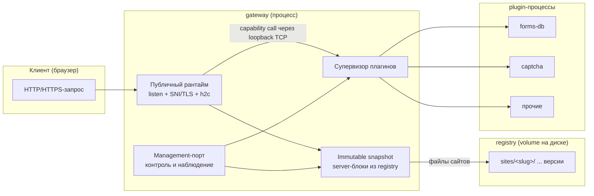

# Liapoldus: архитектура

Этот каталог описывает **целевую** архитектуру Liapoldus: состав и границы
проектов, устройство gateway, контракт плагинов и transport protocol.
В описании нет переходных механизмов и история не фиксируется — только
итоговое состояние, к которому ведётся разработка.

Liapoldus состоит из двух частей:

1. **Gateway** — самостоятельный multi-tenant L7 reverse proxy («микро-nginx»).
   Работает без собственной базы данных: читает персональные конфиги и готовые
   артефакты сборки с диска (registry-volume) и управляет внешними
   plugin-процессами.
2. **Plugins** — отдельные кроссплатформенные процессы, которые gateway
   запускает и вызывает через plugin protocol. Плагин не знает о системе
   управления gateway.

Gateway — единственная обязательная часть; plugins подключаются по мере
надобности.

## Документы

| Файл | Содержание |
| --- | --- |
| [structure.md](structure.md) | Структура репозиториев, обязательные DDD-слои, правила зависимостей, общая библиотека `pkg`. |
| [gateway.md](gateway.md) | Data plane и control plane gateway, путь запроса, immutable snapshot, управление и метрики. |
| [protocol.md](protocol.md) | Transport: TCP loopback, protobuf, length-prefixed frames, multiplexing, методы, streams, ошибки → 5xx. |
| [contract.md](contract.md) | Контракт протокола для авторов плагинов: методы, фреймы, streams, ошибки. |
| [guide.md](guide.md) | Гайд создания плагина на Go с `pkg/pluginprotocol`. |

Документация по декларации, супервизору и жизненному циклу плагинов ведётся в
разделе «[Плагины](/plugins/)»; контракт протокола и гайд создания — выше в
таблице.

## Общая схема

Gateway слушает публичные запросы, раздаёт файлы из актуального снапшота
registry и делегирует вызовы возможностей внешним плагинам. Управление
(оператор) пишет в registry и дергает management-порт gateway —
сам gateway ничего не хранит в БД.

## Ключевые принципы

- **Gateway без БД.** Всё, что нужно для обслуживания (конфиги, версии сайтов),
  находится на диске в registry. Источник состояния — файлы; runtime — производная
  величина.
- **Один процесс.** Gateway — единственный процесс: data plane и управление
  без собственной БД. Files — источник состояния, registry — общий диск.
- **Plugins — отдельные процессы.** Gateway сам запускает каждый инстанс и может
  запустить несколько инстансов одного бинарника с разными конфигами.
- **TCP, не HTTP/gRPC.** Plugin IPC — localhost TCP + protobuf + length-prefixed
  frames. Плагин никогда не обращается к HTTP/gRPC для IPC.
- **DDD-слои для всех Go-проектов**, единая общая библиотека `pkg` через
  `go.work`.