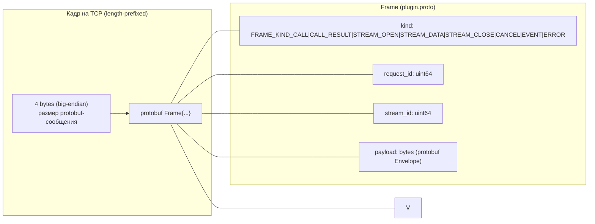
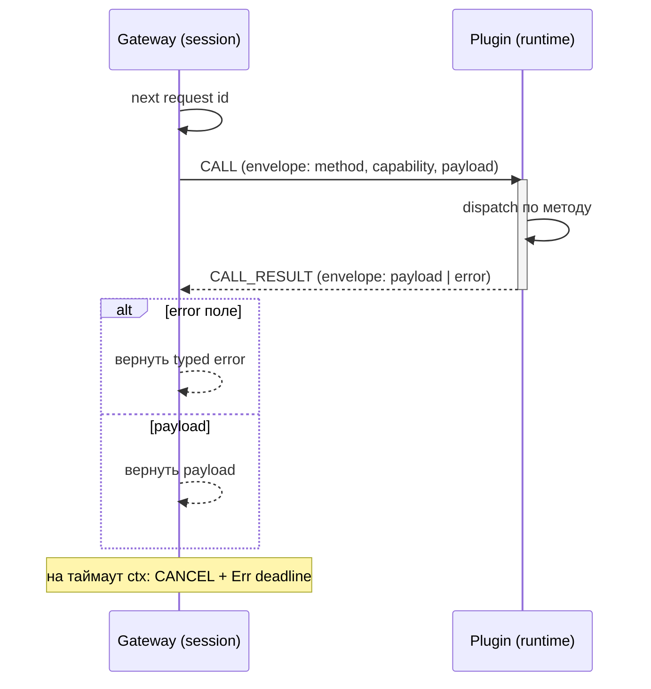
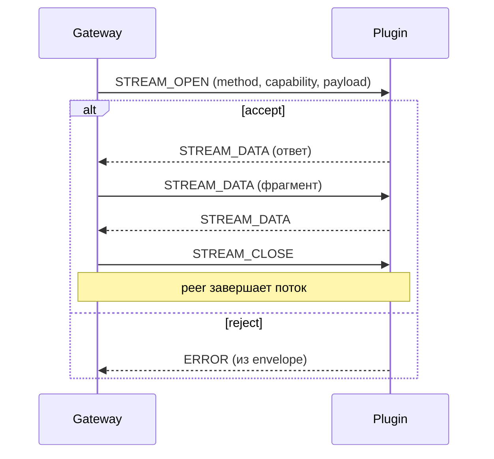

# Plugin protocol

Transport и wire-формат взаимодействия gateway с plugin-процессами. Это
единственный способ IPC: **никакого HTTP/gRPC для plugin-протокола** и никакого
UDP (UDP не гарантирует доставку, порядок, целостность stream и backpressure).

Реализация — общая библиотека `pkg/pluginprotocol` (модуль
`liapoldus.local/pkg/pluginprotocol`), импортируемая и gateway (клиент), и
каждым плагином (сервер).

## Принципы транспорта

- **localhost TCP**, bind только на loopback; порт заранее выбирает gateway и
  передаёт плагину через `--port`.
- **protobuf messages без gRPC**: frame — protobuf-сообщение, передаваемое
  поверх TCP.
- **length-prefixed binary frames**: 4 байта big-endian длина + payload
  (поддерживает partial reads, потоковые ответы, multiplexing).
- **request ID и stream ID** для мультиплексирования параллельных вызовов на
  одном соединении.
- **cancellation, deadlines, backpressure, graceful shutdown** — встроены в
  сессию.



Флоу чтения сессии разделяет кадры по `StreamID`/`RequestID`:

- `StreamID != 0` → в канал соответствующего stream;
- иначе → в `pending[RequestID]` для unary call;
- `EVENT` кадры (protocol logs) → в колбэк onEvent (не смешиваются с вызовами).

## FrameKind

| Значение | Имя | Назначение |
| --- | --- | --- |
| 0 | `FRAME_KIND_UNSPECIFIED` | не используется |
| 1 | `CALL` | unary вызов / начало stream `STREAM_OPEN` |
| 2 | `CALL_RESULT` | ответ на unary call |
| 3 | `STREAM_OPEN` | открытие stream |
| 4 | `STREAM_DATA` | очередной фрагмент stream |
| 5 | `STREAM_CLOSE` | завершение stream (клиент ↔ сервер) |
| 6 | `CANCEL` | отмена (в т.ч. при таймауте) |
| 7 | `EVENT` | protocol log / event (не RPC) |
| 8 | `ERROR` | реджект на старте stream |

## Envelope и Error

```proto
message Envelope {
  string         method     = 1;
  string         capability = 2;
  map<string,string> metadata = 3;
  bytes          payload    = 4;
  Error          error      = 5;
}

message Error {
  string code      = 1;
  string message   = 2;
  bool   retryable = 3;
}
```

- `Error` внутри Envelope — typed error: машиночитаемый `code`, человеческий
  `message`, флаг `retryable` (например `db_error: retryable`, `not_found`,
  `bad_request`, `validation_failed`, `unknown_method`, `invalid_stream_method`).
- `payload` бизнес-методов — JSON (gateway-проксирование возвращает его как
  есть).

## Методы протокола

| Метод | Тип | Назначение |
| --- | --- | --- |
| `manifest` | unary | self-description: имя и capabilities |
| `health` | unary | `{ready: true}` — готовность |
| `config.schema` | unary | YAML-схема конфига плагина |
| `config.apply` | unary | применить runtime-конфиг (payload — содержимое файла) |
| `shutdown` | unary | graceful stop (`{closed: true}`) |
| `*` (бизнес) | unary или stream | объявленные capabilities плагина |

`manifest`, `health`, `config.schema`, `config.apply`, `shutdown` — только
unary: попытка открыть по ним stream отклоняется `ERROR` с кодом
`invalid_stream_method`. Runtime конфигурация плагина — часть `gateway.yaml`;
при запуске/reload она передаётся плагину через `config.apply`.

Protocol logs: плагин шлёт `EVENT`-кадры с payload `{"level","message",
"fields"}` (уровни `debug|info|warn|error`); gateway видит их отдельными
сообщениями и не путает с ответами на вызовы.

## Unary call



Лимиты сессии: `MaxPayloadBytes` (ошибка `payload_too_large`),
`CallTimeoutMillis` (авт. deadline через context), `MaxFrameBytes`
(`frame_too_large`, проверяется при отправке).

## Streams

Одно соединение мультиплексирует многоstream параллельно. Stream-ид
присваивается gateway; все фреймы stream несут `StreamID`.



- `STREAM_OPEN` → сервер сам решает: ответить данными или `ERROR` (rejected).
- `STREAM_DATA` — фрагмент потока (client→server и server→client одновременно:
  bidirectional).
- `STREAM_CLOSE` с одной стороны — сигнал `io.EOF` получателю.
- `CANCEL` — отмена (по таймауту/запросу); не считается штатным завершением.
- Backpressure: сессия имеет буферизованные каналы на stream + TCP flow control;
  это гарантирует целостность потока и отсутствие потерь.

## L4 sessions и UDP flows

После выбора YAML-rule Gateway открывает capability session для TCP либо
datagram flow для UDP. Gateway остаётся владельцем публичного socket, лимитов,
TLS и маршрутизации; plugin получает только поток/датаграммы и разрешённый
контекст. Плагин не открывает listener и не определяет сетевую политику.

TCP session использует bidirectional stream с lifecycle connect → data → close.
UDP flow использует сообщения datagram → result до flow idle timeout. Отмена,
backpressure, payload limits и typed errors соответствуют общему protocol
contract.

## Cancellation и deadlines

- У каждой операции есть `context.Context`; при истечении deadline gateway шлёт
  `CANCEL` и возвращает `ctx.Err()`.
- `CANCEL` удаляет stream/request из таблиц мультиплексера.
- Session `Close()` рассылает `ErrSessionClosed` всем pending/stream каналам,
  закрывает TCP и дожидается завершения readLoop (graceful teardown).

## Ошибки → 5xx

Gateway классифицирует сбои и выдаёт согласованные HTTP-ответы:

| Ошибка | HTTP |
| --- | --- |
| failure запуска плагина | 502 / 503 |
| startup timeout | 503 Service Unavailable |
| connection refused / disconnect | 503 / 504 |
| call timeout | 504 Gateway Timeout |
| protocol violation / malformed frame | 502 Bad Gateway |
| oversize frame/request/response | 502/503 по типу |
| concurrency / resource limit | 503 |
| plugin internal error (`Error{code}`) | 502 |

Retryable-ошибки плагина могут повторяться собрано (gateway решает), но ответ
клиенту всегда согласованный 5xx.

## Требования к реализации

Для протокола обязательны: race-тесты, fuzz/negative tests, malformed frames,
oversized messages, concurrent calls, все направления stream, cancellation,
restart и cross-platform compile checks (macOS/Windows/Linux).
