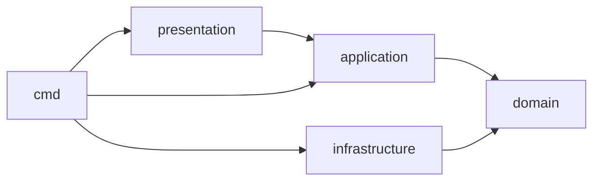

# Кодовая архитектура

Каждый Go-проект использует направленную архитектуру. Domain описывает
инварианты и порты; application реализует use cases; infrastructure подключает
внешний мир; presentation принимает YAML, CLI и HTTP. `cmd` — единственный
composition root.

```text
cmd/gateway/                 composition root
internal/domain/             models, policies, ports, domain errors
internal/application/        compile, apply, route, publish, rollback use cases
internal/infrastructure/     network, DNS, filesystem, ACME, IPC, OTLP adapters
internal/presentation/       YAML DTO, CLI, Management API, HTTP/L4 adapters
```



`domain` не импортирует transport, YAML, SQL, filesystem, DNS, TLS/ACME,
protobuf или observability SDK. `application` зависит только от domain ports.
`presentation` не создаёт concrete adapters, а `infrastructure` не знает use
cases. Нарушение направлений проверяет architecture lint в CI.

## Доменные абстракции

| Область | Модели и порты |
| --- | --- |
| Конфигурация | `ConfigSource`, `IncludeResolver`, `SecretResolver`, `Compiler`, `CompiledGraph`, `Revision` |
| Runtime | `RuntimeSnapshot`, `SnapshotStore`, `Listener`, `Connection`, `DatagramFlow` |
| Маршрутизация | `Matcher`, `Condition`, `Route`, `Action`, `PolicyChain` |
| TLS | `TLSProfile`, `CertificateProvider`, `ACMEIssuer`, `ClientIdentityVerifier` |
| Upstream | `Upstream`, `EndpointResolver`, `HealthChecker`, `LoadBalancer`, `ConnectionPool` |
| Безопасность | `Authenticator`, `TokenVerifier`, `OIDCClient`, `WAFPolicy`, `RateLimiter` |
| Registry | `Site`, `Release`, `PublicationStore`, `RollbackService` |
| Plugins | `PluginInstance`, `Capability`, `PluginSession`, `PluginSupervisor` |
| Управление | `Actor`, `Authorizer`, `AuditLog`, `ConfigWriter` |
| Наблюдаемость | `Telemetry`, `RequestContext`, `Redactor` |

## Контракты и ошибки

Порты возвращают typed domain errors: `ValidationError`, `ReferenceError`,
`RevisionConflict`, `NoHealthyEndpoint`, `PolicyDenied`, `PluginUnavailable`,
`ResourceExhausted` и `ApplyFailed`. Presentation отображает их в YAML-path,
HTTP status или CLI exit code; infrastructure не определяет публичные коды
ответа.

Общая библиотека ограничена transport-neutral plugin IPC primitives. Модели
конфигурации, auth и политик не выносятся в shared package: ядро остаётся
единственным владельцем их контракта.
