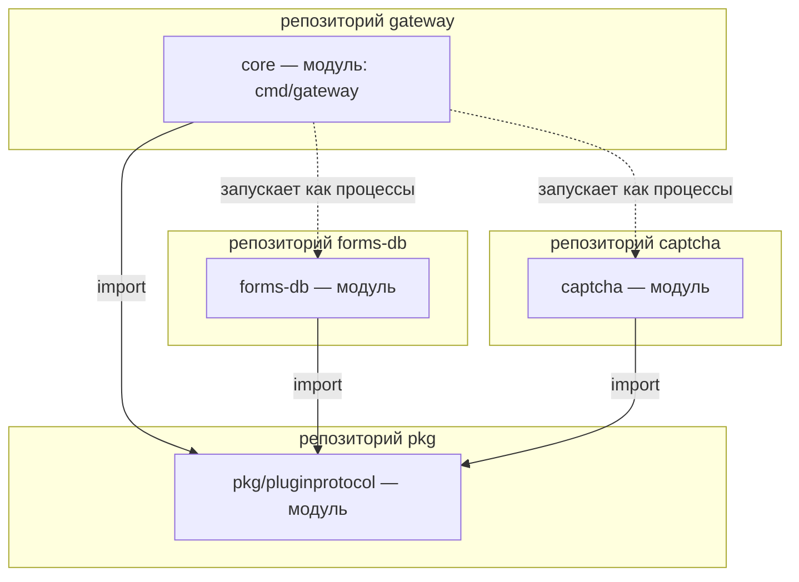
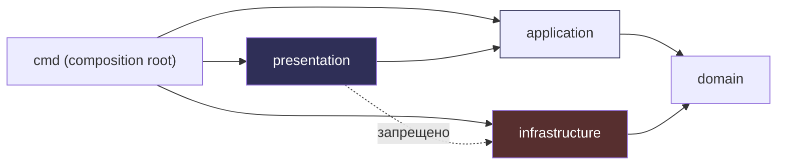

# Структура проектов и правила зависимостей

## Репозитории и модули

Корень рабочего каталога не является Git-репозиторием. Репозитории находятся
в отдельных каталогах; каждый Go-проект — отдельный модуль.

```text
gateway/                 # Git-репозиторий gateway (только ядро)
  core/                  # Go-модуль gateway (единственный бинарник)
forms-db/                # Git-репозиторий и Go-модуль плагина форм
captcha/                 # Git-репозиторий и Go-модуль плагина капчи
pkg/                     # отдельный Git-репозиторий общих библиотек
```

Каждый плагин — отдельный git-репозиторий со своим Go-модулем, не в
репозитории ядра gateway.



Все модули объединяются в корневой `go.work`:

```text
use (
    ./pkg
    ./tools/architecturelint
    ./gateway/core
    ./forms-db
    ./captcha
)
```

Сборка использует только `go.work`; временные зависимости в production
`go.mod` не добавляются.

## Обязательная DDD-структура

Каждый Go-проект имеет четыре слоя, независимо от размера:

```text
cmd/<app>/main.go                # composition root
internal/domain                  # домен
internal/application             # use cases / orchestration
internal/infrastructure          # адаптеры внешнего мира
internal/presentation            # HTTP/CLI/plugin protocol handlers
```

### Правила зависимостей

```text
cmd (DI/composition root)
 ├── presentation → application → domain
 └── infrastructure → domain
```



### `domain`

Разрешены только:

- доменные модели, агрегаты и value objects;
- доменные ошибки;
- интерфейсы портов / repositories / services;
- конструкторы и методы, проверяющие доменные инварианты;
- чистая стандартная библиотека, если она нужна модели.

Запрещены: HTTP, TCP, protobuf, gRPC, SQL, ORM, YAML, filesystem, управление
процессами, логгеры, метрики, application-сервисы и конкретные
инфраструктурные типы.

### `application`

Use cases и orchestration. Использует только `domain`; не знает о конкретных
БД, HTTP, process manager, YAML, protobuf или plugin transport. Все внешние
зависимости application получает через интерфейсы `domain`.

Пример из gateway: `application.PluginService{Manager: domain.PluginManager}` —
вызывает менеджера через порт, не зная про `pluginmgr`.

### `infrastructure`

Реализует порты `domain`: БД, filesystem, subprocess lifecycle, TCP/protobuf
соединения, builders, gateway clients, observability adapters и прочие внешние
интеграции. Infrastructure **не импортирует** application.

### `presentation`

HTTP/CLI/plugin protocol handlers, DTO, decode/encode, маршруты, преобразование
ошибок и transport-specific middleware. Вызывает application и не создаёт
concrete infrastructure.

Например, CLI gateway: `cli.Env` содержит фабрики `NewPluginManager` и
`NewMetrics`, инъекционные в `cmd`. Presentation-слой не создаёт супервизор сам.

### `cmd`

Единственный composition root. Здесь создаются concrete адаптеры, конфигурация,
logger/metrics, application-сервисы и presentation-серверы и передаются через
конструкторы. `cmd/gateway/main.go` собирает `cli.Env` с фабриками
`infrastructure.PluginManager{Supervisor: pluginmgr.New(...)}`.

## Линтер архитектуры

Два механизма проверки работают параллельно:

1. собственный `go/analysis` lint в `tools/architecturelint`;
2. простой CI/import script как резервная проверка.

Линтер запрещает:

- `domain` → `application` / `infrastructure` / `presentation`;
- `application` → `infrastructure` / `presentation`;
- `infrastructure` → `application`;
- presentation создаёт concrete infrastructure;
- DI-concrete implementations вне `cmd`;
- transport/SQL/YAML/protobuf-зависимости в `domain`.

Нарушение завершает CI с понятным сообщением о допустимом направлении
зависимости.

## Общая библиотека `pkg`

`pkg` — отдельный Git-репозиторий с одним `go.mod`. Подключается через корневой
`go.work` (`replace liapoldus.local/pkg v0.0.0 => ./pkg`).

Общие библиотеки появляются только для самостоятельной логической области,
используемой несколькими проектами. На текущем этапе целевая общая библиотека —
единственная: `pkg/pluginprotocol` (протокол, frames, session, server, runtime).
Она используется gateway (клиент) и всеми плагинами (сервер).

Запрещено выносить код ради механического переиспользования. В частности,
общей библиотеки auth/permissions нет: gateway имеет собственную модель
авторизации. Config и errors остаются локальными для каждого проекта.

## namespace модулей

Локальный namespace — `liapoldus.local/...`. Известные модули:

- `liapoldus.local/gateway/core`
- `liapoldus.local/forms-db`
- `liapoldus.local/captcha`
- `liapoldus.local/pkg/pluginprotocol`

Namespace меняется только отдельным решением.