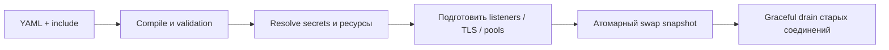

# Reload и конфликты

Gateway применяет конфигурацию как immutable runtime snapshot. Reload не
меняет работающий snapshot, пока дерево include, секреты, ссылки на ресурсы,
regex, сертификаты и listeners не прошли полную проверку.

## Изменение конфигурации

Файлы, CLI и Management API равноправны. Каждая применённая конфигурация имеет
`revision` и `digest`. API-запись передаёт `If-Match: <digest>`; несовпадение
возвращает `409 Conflict` с актуальными метаданными и ничего не перезаписывает.

| Операция | Результат |
| --- | --- |
| `gateway config validate` | компилирует YAML без изменения runtime |
| `gateway reload` | проверяет и применяет новое дерево файлов |
| `POST /api/reload` | перечитывает файлы и возвращает revision/digest |
| `PUT /api/config` | атомарно пишет YAML при корректном `If-Match` и применяет его |

Изменение listener address или типа создаёт новый listener до закрытия старого,
если ОС позволяет bind. Иначе API возвращает `409 restart-required` и точно
называет конфликтующее поле. Каждая попытка изменения записывается в audit log
с actor, временем, digest до/после и результатом.
