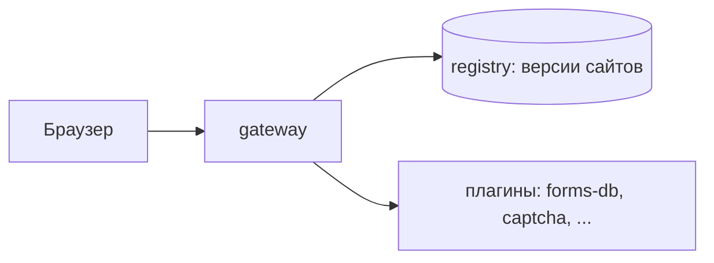

# Gateway

**Gateway** — центральный и обязательный компонент Liapoldus: независимый
multi-tenant L7 gateway («микро-nginx») для публичных сайтов. Он раздаёт
статические артефакты из локального registry-каталога, применяет маршруты и
редиректы, обслуживает TLS/HTTP/2 и вызывает внешние **plugins** — отдельные
процессы с формами, капчей и другой логикой.

## Модель



| Часть | Назначение | Зависимости |
| --- | --- | --- |
| **gateway** | публичный рантайм, раздача сайтов, плагины | без БД; читает файлы конфигов и registry |
| **plugins** | отдельные binary: формы, капча и т.д. | TCP loopback + protobuf протокол |

Gateway — обязательная часть; plugins подключаются по мере необходимости.

## Возможности

- **Сайты из registry.** Версии раздаются из `sites/<slug>/<version>/`,
  `current` — активная, `prev` — резервная для мгновенного отката.
- **Server-блоки.** Слушатели, выбор по Host, статика, `proxyPass`, редиректы,
  маршруты, языки сайтов.
- **TLS и HTTP/2.** Мульти-сертификатный SNI-подбор, ALPN h2, h2c на «голом»
  HTTP.
- **Обычные веб-функции.** Сжатие gzip/brotli, access-лог, rate limit по IP,
  CORS, security-заголовки, ETag и Cache-Control.
- **Плагины.** Внешние процессы, запускаемые gateway, с полноценным
  протоколом (unary + все направления stream).
- **Управление.** CLI-подкоманды (офлайн-доставка) и резервированный
  management HTTP API.
- **Наблюдаемость.** Prometheus и OTLP push экспорт, структурированные логи.

## Быстрый старт

Минимальный запуск gateway за несколько минут.

### 1. Соберите gateway

```bash
cd gateway/core
go build ./cmd/gateway
```

Бинарник появится как `gateway` в текущей директории (или задайте
`-o ./bin/gateway`).

### 2. Создайте конфиг

`gateway.yaml`:

```yaml
# Публичный порт по умолчанию (для implicit-сайтов и server без listen).
listen: "18080"

# Каталог registry: sites/<slug>/current/...
registry: ./data/registry

# Управление: порт и токен (пустой токен — только loopback).
management:
  enabled: true
  port: "18090"
  token: ""
```

### 3. Опубликуйте простой сайт

Создайте версию сайта в registry. Персональный конфиг сайта — unified schema:

```bash
mkdir -p data/registry/sites/example/current
echo '<h1>Hello, Liapoldus</h1>' > data/registry/sites/example/current/index.html

cat > data/registry/sites/example/config.yaml <<'YAML'
slug: example
hosts: [example.localhost, localhost]
languages: [ru]
defaultLang: ru
loginRequired: false
YAML
```

### 4. Запустите

```bash
./bin/gateway serve
# или с явным путём к конфигу:
LIAPOLDUS_GATEWAY_CONFIG=gateway.yaml ./bin/gateway serve
```

Вывод должен показать публичный runtime и management-порт:

```text
gateway: публичный рантайм слушает :18080 (режим gateway)
gateway: mgmt :18090 слушает (токен не задан — только loopback)
```

### 5. Проверьте

```bash
curl -H 'Host: example.localhost' http://localhost:18080/
# -> <h1>Hello, Liapoldus</h1>

curl http://localhost:18090/healthz
# -> {"status":"ok","process":"gateway-mgmt"}
```

Если `Host` не задан, gateway выберет подходящий блок по умолчанию.

## Разделы документации

<div class="cards">
  <a class="card" href="/gateway/examples/">
    <h3>Практические примеры</h3>
    <p>Полные сценарии настройки: статика, reverse proxy, TLS, формы, капча.</p>
  </a>
  <a class="card" href="/gateway/configuration/">
    <h3>Configuration</h3>
    <p>gateway.yaml, server-блоки, TLS/SNI, reload, management API, безопасность.</p>
  </a>
  <a class="card" href="/gateway/cli/">
    <h3>CLI</h3>
    <p>Подкоманды: версии сайтов, откат, диагностика диска.</p>
  </a>
  <a class="card" href="/gateway/deploy/">
    <h3>Deploy</h3>
    <p>Локальная разработка, Docker Compose, переменные окружения.</p>
  </a>
  <a class="card" href="/gateway/architecture/">
    <h3>Архитектура</h3>
    <p>Структура проектов, data/control plane gateway, plugin protocol.</p>
  </a>
</div>

Краткое содержание каждого каталога — в [обзоре архитектуры](/gateway/architecture/).
Плагины и их настройка описаны отдельно в разделе «[Плагины](/plugins/)».