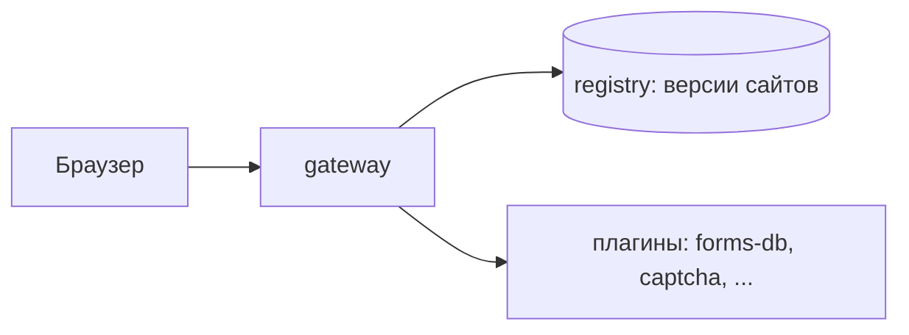

# Liapoldus

**Liapoldus** — набор компонентов для сборки, раздачи и поддержки публичных
сайтов. Ядро — независимый multi-tenant L7 **gateway** («микро-nginx»): он
раздаёт статические артефакты из локального registry-каталога, применяет
маршруты и редиректы, обслуживает TLS/HTTP/2 и запускает внешние **plugins** —
отдельные процессы с формами, капчей и другой логикой.

## Компоненты

| Компонент | Назначение | Зависимости |
| --- | --- | --- |
| **gateway** | публичный рантайм, раздача сайтов, плагины | без БД; читает файлы конфигов и registry |
| **plugins** | отдельные binary: формы, капча и т.д. | TCP loopback + protobuf протокол |

Gateway — обязательная часть; plugins подключаются по мере необходимости.
Каждый компонент — отдельный бинарник со своим протоколом и контрактом.

## Документация

[Перейти к документации Gateway](/gateway/)

- [Configuration](/gateway/configuration/) — `gateway.yaml`, management API,
  безопасность.
- [CLI](/gateway/cli/) — подкоманды: версии, откат, диагностика.
- [Deploy](/gateway/deploy/) — локальная разработка, Docker Compose, переменные
  окружения.
- [Архитектура](/gateway/architecture/) — структура проектов, data/control
  plane gateway, plugin protocol.
- [Плагины](/plugins/) — декларация, жизненный цикл и существующие плагины
  (forms-db, captcha).