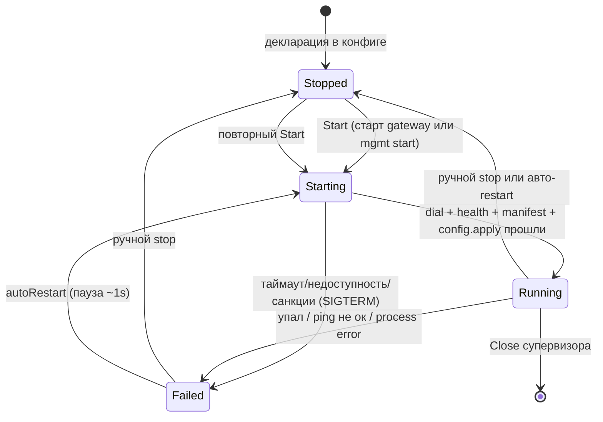
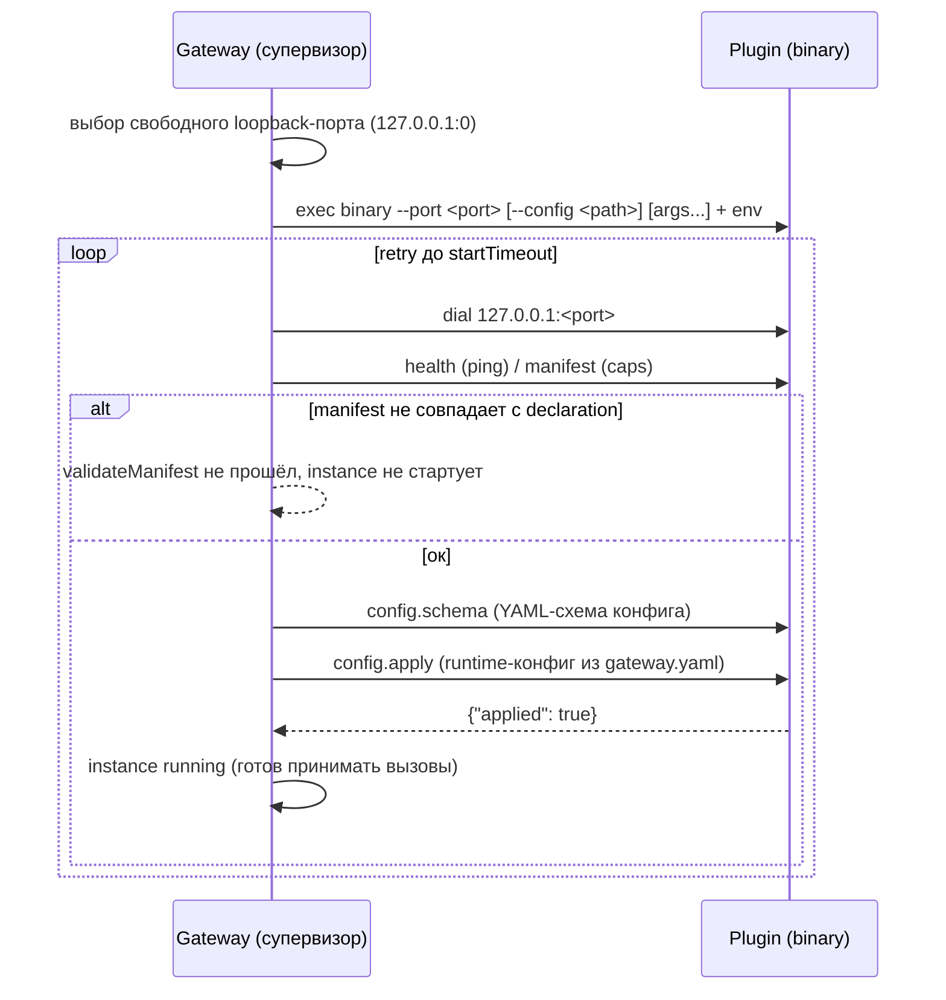

# Плагины

Плагины — независимые кроссплатформенные **binary-процессы**. Gateway сам
запускает каждый **instance** как subprocess, связывается с ним по localhost
TCP/protobuf и вызывает объявленные **capabilities**.

Каждый плагин живёт в **отдельном git-репозитории** со своим Go-модулем —
не в репозитории ядра gateway. Из репозитория плагина собирается его
собственный бинарник, который gateway запускает.

Плагин не знает о системе управления вне gateway. Вся связь идёт только через
gateway: он передаёт конфиг instance, а схему `config.schema` отдаёт наружу
по management API. Никто не подключается к плагинам напрямую.

## Декларация

Плагины объявляются **только явно** в `gateway.yaml` (или include-файлах) под
секцией `plugins`. Без декларации gateway ничего о плагине не знает. `id`
плагина — ключ секции.

```yaml
plugins:
  forms-db:                      # id == ключ
    manifest:                    # ожидаемый контракт instance (обязательно)
      protocol: liapoldus.plugin/v2
      name: forms-db
      capabilities: [forms.submit, forms.list, forms.delete]
    enabled: true                # запускать при старте gateway
    binary: ./bin/forms-db       # abs или относительно gateway.yaml
    config: ./conf/forms-db.yaml # собственный конфиг плагина (--config)
    args: []                     # доп. аргументы
    env:                         # env с подстановкой env:NAME
      - DATABASE_URL=env:DATABASE_URL
    autoRestart: true            # перезапуск при падении
    startTimeout: 10s            # таймаут старта (default 10s)
    healthInterval: 15s          # периодичность health-проверок (default 15s)
```

### Контракт instance

`manifest` в конфиге — transport-independent декларация. При старте gateway
сверяет её с self-description запущенного плагина:

- `name` запущенного плагина должен совпадать с id;
- `protocol` должен совпадать;
- каждая задекларированная capability обязана фактически рекламироваться
  плагином. Никакие capabilities не зашиты в ядро gateway.

Несколько instances одного binary с разными `config`/`env` независимы — порт
выбирается gateway на каждый процесс. Пустой manifest запрещён
в production-конфиге (допустим только в unit-тестах).

## Жизненный цикл



Последовательность старта:



Переходы:

- **Stopped** — декларирован, не запущен.
- **Starting** — процесс стартует, gateway ждёт ready (`startTimeout`).
- **Running** — ping, manifest и config.apply прошли; health-проверки идут
  каждые `healthInterval`; при падении процесса — restart (autoRestart) или fail.
- **Failed** — не удалось стартовать/связь пропала; `lastError` фиксируется.

### Стоп и управление

- Graceful stop: `shutdown` RPC (контекст 5s) → `SIGTERM` → пауза 200ms →
  `SIGKILL` (фолбек).
- Ручной `stop` выставляет флаг: пока не последует явный `start`, супервизор
  не рестартует.
- `generation` отменяет устаревший запуск после stop/restart (защита от гонок
  раундов).
- Вывод плагина (stdout+stderr) пишется в системный stderr и в кольцевой
  буфер на 200 строк для `GET /api/plugins/{id}/logs`.

## Вызовы capabilities

Capability присваивается HTTP-matcher'у без знания его предметной семантики в
ядре gateway — объявление в `apiRoutes`:

```yaml
server:
  - apiRoutes:
      - methods: [POST]
        path: /api/forms/submit
        plugin:
          instance: forms-db
          capability: forms.submit
```

Gateway проверяет, что capability объявлена в manifest instance; вызов идёт по
plugin protocol (unary Call или stream), ответ возвращается как есть (payload —
JSON).

## Ошибки плагинов → HTTP

| Ошибка запуска/взаимодействия | HTTP-ответ |
| --- | --- |
| failure запуска / startup timeout | 503 Service Unavailable |
| connection refused / disconnect | 503 / 504 |
| call timeout | 504 Gateway Timeout |
| protocol violation, malformed/oversized frame | 502 Bad Gateway |
| concurrency/resource limit | 429 или 503 |
| plugin internal error (typed `Error{code}`) | 502 |

Typed error плагина включает `code`, `message`, `retryable` — gateway решает
про повтор, клиент всегда получает согласованный 5xx. Resource limits
(timeout, размеры сообщений, concurrency) опциональны; memory/CPU-лимиты —
platform-specific и не ломают macOS/Windows/Linux.

## Управление через gateway

Supervisor-эндпоинты management API (см. [Management API](/gateway/configuration/management-api)):
`GET /api/plugins`, `GET /api/plugins/{id}` (состояние/PID/uptime/последняя
ошибка/capabilities), `GET /api/plugins/{id}/logs`, `POST /api/plugins/{id}/
rpc|cancel|restart|stop|start`. Runtime-настройки меняются только через
`gateway.yaml` + reload.

## Существующие плагины

<div class="cards">
  <a class="card" href="/plugins/forms-db">
    <h3>forms-db</h3>
    <p>Формы: submit/list/delete. SQLite, PostgreSQL, MySQL.</p>
  </a>
  <a class="card" href="/plugins/captcha">
    <h3>captcha</h3>
    <p>Stateless-проверка Cloudflare, Google reCAPTCHA, hCaptcha.</p>
  </a>
</div>

## Для авторов плагинов

- [Контракт протокола](/gateway/architecture/contract) — методы, фреймы,
  streams, ошибки.
- [Гайд создания плагина](/gateway/architecture/guide) — пошагово на Go
  с `pkg/pluginprotocol`.