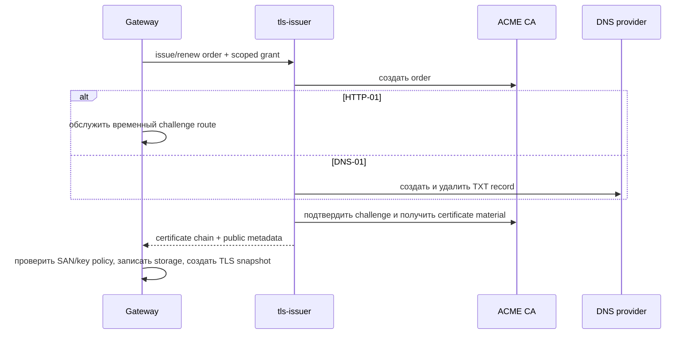

# tls-issuer

`tls-issuer` автоматически выпускает, продлевает и отзывает TLS/mTLS
сертификаты через ACME. Он не имеет доступа к файловой системе Gateway,
не открывает listener и не пишет сертификаты сам: все чувствительные операции
выполняются Gateway через ограниченный control-plane interface.

## Capabilities

| Capability | Назначение |
| --- | --- |
| `tls.issue` | создать ACME order, пройти challenge и вернуть certificate material |
| `tls.renew` | продлить certificate material перед истечением срока |
| `tls.revoke` | отозвать certificate material по явной операции оператора |

## Конфигурация

```yaml
secrets:
  cloudflareDnsToken: env:CLOUDFLARE_DNS_TOKEN

plugins:
  tls-issuer:
    binary: ./bin/tls-issuer
    config: ./plugins/tls-issuer.yaml
    capabilities: [tls.issue, tls.renew, tls.revoke]
    grants:
      storage: [tls-public]
      secrets:
        - name: cloudflareDnsToken
          purpose: acme-dns01
          domains: [example.com, '*.example.com']

tlsIssuers:
  public-acme:
    plugin: { instance: tls-issuer, capability: tls.issue }
    storage: tls-public
    directory: https://acme-v02.api.letsencrypt.org/directory
    account: { email: ops@example.com }
    challenges:
      http01: { listener: public-http }
      dns01: { secret: cloudflareDnsToken }
    renewal: { before: 30d, retry: { initial: 5m, max: 12h } }
```

`http01.listener` назначает listener, на котором Gateway временно обслуживает
ACME challenge path. Для DNS-01 Gateway выдаёт только временный scoped grant:
плагин получает DNS-токен во время операции, исключительно для указанных
доменов и purpose `acme-dns01`. Секрет не появляется в plugin config, логах,
diagnostics или произвольном IPC metadata.

## Контракт control-plane



Плагин возвращает материал сертификата только по защищённому IPC. Gateway
проверяет, что SAN входят в domains grant, ключ соответствует certificate,
а issuer и storage разрешены. После записи Gateway обновляет TLS для новых
соединений без прерывания активных, пишет audit event и публикует telemetry.

## Хранение и отказоустойчивость

`storage` — локальное защищённое файловое хранилище Gateway. Оно содержит
ACME account key, private keys, certificate chain, метаданные order и время
следующего renewal. Плагин оперирует opaque handles и не получает путь к файлу.

Renewal запускается до `renewal.before`; неуспешная попытка повторяется с
bounded backoff до `renewal.retry.max`. Пока существующий сертификат действителен,
Gateway продолжает использовать его. Если срок истекает без успешного renewal,
Gateway отправляет alert и помечает TLS profile как degraded.
