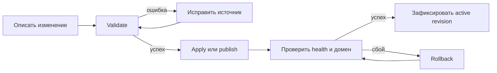

# Пользователи и UX

UX Liapoldus — это опыт автора сайта, оператора и автоматизации в файлах, CLI
и management API. Административная панель не обязательна: если она появится,
то останется клиентом тех же контрактов, а не вторым способом изменить runtime.

## Модель действия

У любого изменения один и тот же жизненный цикл: **описать → проверить →
применить → подтвердить → при необходимости откатить**. Проверка ничего не
меняет; применение создаёт новый целостный результат; подтверждение показывает
пользователю, что именно стало активным.

Каждый шаг имеет одну точку входа, машиночитаемый результат и следующее
безопасное действие. Публикация создаёт релиз до переключения `current`, а
откат до выполнения называет релиз, который станет активным.

## Роли и ожидаемый результат

| Роль | Делает | Получает |
| --- | --- | --- |
| Автор сайта | добавляет артефакт и `site.yaml` | локально проверяемый сайт без доступа к runtime |
| Оператор | применяет конфиг и публикует релиз | revision, digest, active/previous release и команду проверки |
| CI | выполняет validate/publish/reload | стабильные exit codes, JSON и идентификатор операции |
| Разработчик плагина | объявляет capability и конфиг | изолированный процесс без права менять маршрутизацию |

## Поведение при ошибке

Ошибка должна отвечать на четыре вопроса: **что не получилось, где источник,
было ли что-то изменено и что делать дальше**. Формат не зависит от интерфейса:
CLI печатает понятное сообщение и exit code, API — problem response с тем же
кодом и request ID, журнал — структурированное событие без секретов.

## Требования к интерфейсам

| Ситуация | Требование к UX |
| --- | --- |
| Ошибка конфигурации | Указать файл, путь YAML, причину и способ исправления; не запускать частично валидный runtime. |
| Reload требует рестарта | Вернуть `restart-required` с конфликтующими параметрами; не сообщать об успешном reload. |
| Изменение версии | До операции показать `current` и `previous`; после — active release, URL/команду проверки и request ID. |
| Проблема плагина | Разделить ошибку запуска, недоступность и ошибку бизнес-логики; не раскрывать секреты в логах. |
| Автоматизация | CLI и API используют одинаковые термины, идентификаторы и коды ошибок. |

## Документация как интерфейс

Документация ведёт читателя в следующем порядке:

1. «О продукте» — ценность, роли и границы.
2. «Первый сайт» и сценарии — типовая задача без внутренних деталей.
3. Конфигурация, CLI и развёртывание — канонический справочник эксплуатации.
4. Архитектура и протокол — требования к реализации Gateway и плагинов.

На страницах с командами и API используются единые термины, идентификаторы и
коды ошибок. Пример можно повторить без обращения к исходному коду gateway.

## Критерии качества

- Оператор публикует и откатывает простой сайт без доступа к исходному коду
  Gateway.
- Любую проблему можно локализовать по health, структурированному логу и
  идентификатору запроса.
- Внешний плагин не получает сетевой доступ и данные шире, чем нужны его
  capability.
- Поведение одинаково документировано для CLI, API и файловой структуры.
