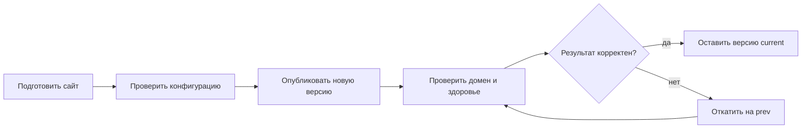

# Пользователи и UX

UX Liapoldus — это прежде всего опыт работы оператора в CLI, конфигурации и
management API. Административная веб-панель не является обязательной частью
продукта: её появление не меняет модель данных и не обходит валидацию gateway.

## Основной путь оператора

Каждый шаг должен иметь одну понятную точку входа, машиночитаемый результат и
следующее безопасное действие. Например, проверка не меняет файлов, публикация
создаёт новый release до переключения `current`, а откат всегда показывает
release, на который переключится сайт.

## Требования к интерфейсам

| Ситуация | Требование к UX |
| --- | --- |
| Ошибка конфигурации | Указать файл, путь YAML и объяснение; не запускать частично валидный runtime. |
| Reload требует рестарта | Вернуть явный статус с перечнем изменённых параметров, а не сообщать об успешном reload. |
| Изменение версии | До операции показать `current` и `prev`; после — дать URL/команду проверки. |
| Проблема плагина | Разделить ошибку запуска, недоступность и ошибку бизнес-логики; не раскрывать секреты в логах. |
| Автоматизация | CLI и API используют одинаковые термины, идентификаторы и коды ошибок. |

## Информационная архитектура документации

Документация ведёт читателя в следующем порядке:

1. «О продукте» — зачем система нужна и где её границы.
2. «Первый сайт» и сценарии — решение типовой задачи без погружения в детали.
3. Конфигурация, CLI и deployment — справочник для эксплуатации.
4. Архитектура и протокол — материал для команд, реализующих ядро и плагины.

На страницах с командами и API используются единые термины, идентификаторы и
коды ошибок. Пример можно повторить без обращения к исходному коду gateway.

## Критерии качества

- Оператор публикует и откатывает простой сайт без доступа к исходному коду
  gateway.
- Любую проблему можно локализовать по health, структурированному логу и
  идентификатору запроса.
- Внешний плагин не получает сетевой доступ и данные шире, чем нужны его
  capability.
- Поведение одинаково документировано для CLI, API и файловой структуры.
